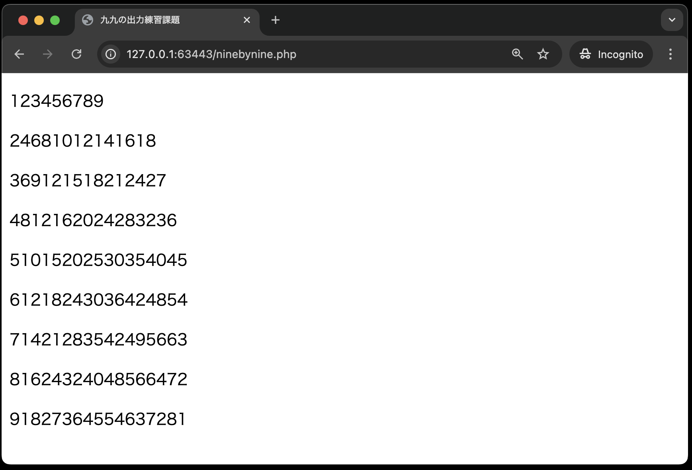

# 課題について

九九を以下の条件で作成してください。

- `public`ディレクトリに、`ninebynine.php`を作成し、コードを記述すること
- **for文を２つ用いて**作成すること
- 改行に関しては`<p> ~ </p>`タグを用いて行うこと<br>
  {: style="width: 660px;height: auto;"}

`ninebynine.php`

```php
<!DOCTYPE html>
<html lang="ja">
<head>
    <meta charset="UTF-8">
    <meta name="viewport" content="width=device-width, initial-scale=1.0">
    <title>九九の出力練習課題</title>
</head>
<body>
    <?php
        # ここに九九のコードを記述する
    ?>
</body>
</html>
```

```tips
## ヒント

ブラウザ上の赤枠の箇所を**for文を使わずに**HTMLで表すと、下記のようになる。

```HTML
<p>123456789</p><p>24681012141618</p><p>369121518212427</p><p>4812162024283236</p><p>51015202530354045</p><p>61218243036424854</p><p>71421283542495663</p><p>81624324048566472</p><p>91827364554637281</p>
```
```

### ブラウザ上での確認方法を忘れた方へ

[『PHPの基本』の「ブラウザ上での確認」](https://2024web1.github.io/web_app_dev/basicphp/#%E3%83%96%E3%83%A9%E3%82%A6%E3%82%B6%E4%B8%8A%E3%81%A7%E3%81%AE%E7%A2%BA%E8%AA%8D)を参考に`ninebynine.php`の確認にチャレンジしてください。

### Dev Containersを起動した状態で、add、commit、pushができない方へ

[『はじめてのPHP』の「Dev Containersを起動した...」](https://2024web1.github.io/web_app_dev/firstphp/#%E8%BF%BD%E8%A8%98dev-containers%E3%82%92%E8%B5%B7%E5%8B%95%E3%81%97%E3%81%9F%E7%8A%B6%E6%85%8B%E3%81%A7addcommitpush%E3%81%8C%E3%81%A7%E3%81%8D%E3%81%AA%E3%81%84%E5%A0%B4%E5%90%88)を参考にしてください。

## 採点について

提出した課題がGitHub上で自動採点されます。pushした課題が合格したかはpush後に必ず確認してください。

### 課題の合格基準について

- `出席番号 名前`が入力されていること。(※出席番号と名前の間の半角スペースお忘れなく！)
- `ninebynine.php`をブラウザで開いた時、段ごとに改行された九九が表示されること
- 九九を作成するプログラムがPHPで書かれていること
- `<p>`タグで改行していること

### 合格確認方法

1. pushし、課題を提出してください。
2. 下記青色背景のリンクからリモートリポジトリにアクセスしてください。※もしこのページを閉じている方は、[今回の課題ページ](https://classroom.github.com/a/7BZ9ZTet)からアクセスすることができます<br>
3. 画面上部にある`Actions`をクリックしてください。<br>
4. **一番上**の行のタイトル横に、緑色のチェックが入っていればOK。<br>
   

### エラーが出た時の対処法

自動採点がエラーになると、タイトルの横に赤いばつ印がでます。その場合の解決策を下記に示します。

#### タイムアウトになっていないかを確認する

※タイムアウト自体はGitHubの仕様上防ぎようがありませんので、あらかじめご了承ください。タイムアウトになっている場合は、GitHub上で処理を再開すると解決できます。<br>
例えば、エラーが出た場合、右端の赤枠で囲まれている箇所に処理時間があります。ここが4分前後かかっている場合は、まずタイムアウトの可能性を疑ってください。


具体的なタイムアウトの確認・解決方法は、

  1. `Actions`のタイトルが下記のようにリンクになっているので、クリック
      
  2. `run-autograding-tests.png`をクリック
      
  3. 赤いばつ印が出ている行をクリックし、開く
      
  4. `Operation timed out after 180000 milliseconds with 0 bytes received`のメッセージがあればタイムアウト
      
  5. 解決策としては、右上に`Re-run jobs`(再実行)のボタンがあるので、`Re-run failed jobs`(失敗した処理だけ再実行)をクリックしてください。
      <br>
      
  6. タイムアウトにならず処理が終了したらOK。また、タイムアウトになった場合は、同じことを繰り返す。※タイムアウトでないエラーは、次の解決策を参照。

### プログラムが正確に書かれているか確認する

プログラムが正確に書かれているかを確認してください。たとえ、ブラウザの画面でそれっぽく表示されても、自動採点ですので融通は聞きません。エラーが出た際は、以下の点を確認してください。

- 出席番号と名前の間に半角スペースはあるか
- 九九の数値は正しいか
- 九九を作成するプログラムがPHPで書かれているか
- `<p>`タグで改行されているか、`</p>`タグを忘れていないか 

### 解答例(5/20追記)

```php
<!DOCTYPE html>
<html lang="ja">

<head>
    <meta charset="UTF-8">
    <meta name="viewport" content="width=device-width, initial-scale=1.0">
    <title>九九の出力練習課題</title>
</head>

<body>
    <?php

    # ここに九九のコードを記述する
    for ($i = 1; $i < 10; $i++) {
        echo "<p>";
        for ($j = 1; $j < 10; $j++) {
            echo $i * $j;
        }
        echo "</p>";
    }
    ?>
</body>

</html>
```
