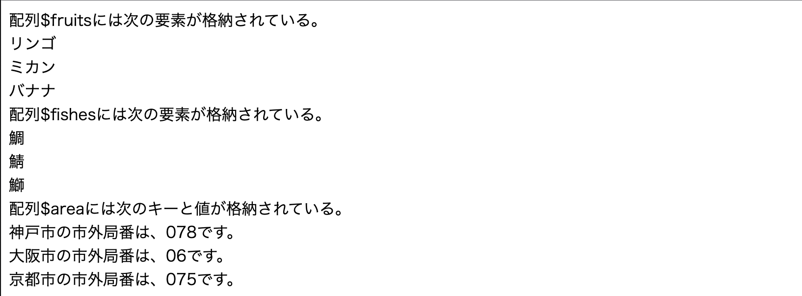

# PHPの書き方③

## 配列

```PHP
配列名 = [ 値１, 値２, ．．．];
配列名 = array ( 値１, 値２, ．．． );
```

### ◆具体例(配列)

```PHP
$fruits = [ 'リンゴ',  'ミカン',  'バナナ' ];
$fishes = array ( '鯛',  '鯖',  '鰤' ); //たい、さば、ぶり
```

## 繰り返しによる要素の取り出し

```PHP
$fruits = [ 'リンゴ',  'ミカン',  'バナナ' ];
for ( $i = 0; $i < count($fruits); $i++) { //count($fruits) で配列$fruitsの要素数を返す
    echo  $fruits [ $i ]  . "<br>";
}
```

```PHP
$fishes = array ( '鯛',  '鯖',  '鰤' );
foreach ( $fishes  as  $fish ) { 　//配列$fishes の要素を $fish として繰り返し処理内で使用する
    echo  $fish . "<br>" ;
}

// PHPでは、基本的に「foreach（フォーイーチ）文」を使用する。
```

## 連想配列

PHPの配列は、「連想配列」の機能を備えていて、「キー」と「値」のペアでデータを格納することができます。

```PHP
配列名 = [ キーA => 値A,  キーB=>値B,  キーC=>値C, ．．．];
（「=>」は、「=」と「>」の２つの記号を用いて記述する。読み方は「ダブルアロー」）
```

### ◆具体例(連想配列)

```PHP
$area =    [ '神戸'=>'078',  '大阪'=>'06',  '京都'=>'075' ];
foreach ( $area  as  $key  =>  $value ) { // 配列$area のキーを$key、値を$valueで処理する
    echo   $key . '市の市外局番は、' . $value . 'です。<br>'; 
}
```

## サンプル

`sample2.php`

```php
<!DOCTYPE html>
<html lang="ja">

<head>
    <meta charset="UTF-8">
    <meta name="viewport" content="width=device-width, initial-scale=1.0">
    <title>サンプル2</title>
</head>

<body>
    <?php
    $fruits = ['リンゴ', 'ミカン', 'バナナ'];
    echo '配列$fruitsには次の要素が格納されている。<br>';
    for ($i = 0; $i < count($fruits); $i++) {
        echo  $fruits[$i]  . "<br>";
    }
    $fishes = array('鯛', '鯖', '鰤'); // タイ、サバ、ブリ
    echo '配列$fishesには次の要素が格納されている。<br>';
    foreach ($fishes  as  $fish) {
        echo  $fish . "<br>";
    }
    $area = ['神戸' => '078',  '大阪' => '06',  '京都' => '075'];
    echo  '配列$areaには次のキーと値が格納されている。<br>';
    foreach ($area  as  $key  =>  $value) {
        echo   $key . '市の市外局番は、' . $value . 'です。<br>';
    }
    ?>
</body>

</html>
```

ブラウザで以下のように表示されればOKです。


