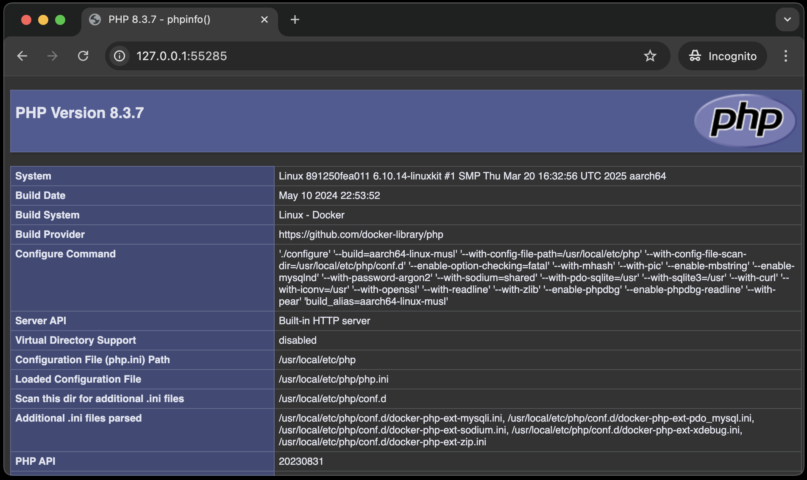

# index.phpについて

URLの末尾にファイル名を指定しなかった場合、`index.php`というファイルがあれば、自動的にそのファイルが実行されます。
ちなみに、本章では`public`ディレクトリに以下のindex.phpを用意しています。

```php
<?php

phpinfo(); // PHPの情報を表示する関数
```

試しにコンテナを起動して、VSCode下部のポートタブからブラウザを起動してみましょう。
URLの末尾にファイル名を指定していませんが、以下のような画面が表示されるはずです。



このように、ファイル名に`index`と指定すると、URLの末尾にファイル名を指定しなくても、そのファイルが実行されます。
これは、PHPだけの仕様ではなく、大抵の言語で共通の仕様です。

末尾にファイル名を指定せずとも実行されるため、`index.php`はWebアプリのトップページとしてよく使われます。
