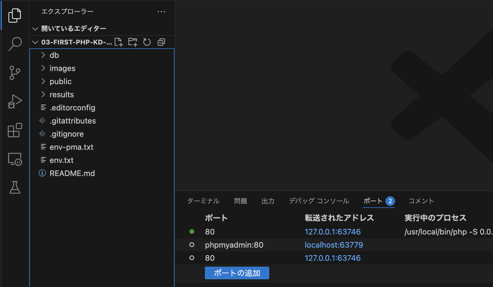

# PHPの書き方

PHPにおける次の１～４の書き方についてサンプルコードを示します。

   1. コメント
   2. 変数
   3. 文字列の連結
   4. シングルクォーテーションとダブルクォーテーションの違い

まず、`public`ディレクトリに、`sample1.php`を作成し、以下のコードを入力してください。

**sample1.php**

```php
<!DOCTYPE html>
<html lang="ja">

<head>
    <meta charset="UTF-8">
    <meta name="viewport" content="width=device-width, initial-scale=1.0">
    <title>サンプル1</title>
</head>

<body>
    <?php
    // PHPのスクリプト内で1行コメントを書くときに使います。
    /*
       C言語やJavaと同じように、
    　 スクリプト内で複数行のコメントを書くときに使います。
    */

    $first_name = "電子"; // 変数の宣言では「型」は必要ありません
    $last_name = "神戸";
    // 文字列の連結は「.(ドット)」を使う
    echo '<p>私の名前は、' . $last_name . $first_name . 'です。</p>';
    $num = 10;
    echo 'シングルクォーテーションでは、変数の値 $num は表示されません。<br>';
    echo "ダブルクォーテーションでは、変数の値 $num が表示されます。";
    ?>
</body>

</html>
```

PHPでは、変数を「**$変数名**」で指定します。
変数名には、次の規則があります。（Javaと一緒）

1. 1文字目は英字またはアンダースコアを使う
2. 2文字目以降は、英字、数字、アンダースコアが使える
3. 英字の大文字と小文字は区別される

## ブラウザ上での確認

ブラウザ上で確認をするために、開発環境に切り替えます。

1. VScodeで、cloneしたディレクトリ`04-basic-php-...`を開く
2. コマンドパレットを開き(Ctrl-Shift-P Macは、(Cmd-Shift-P))、`rebuild`と入力する
3. `Dev Container: Rebuild and Reopen in Container` をクリック<br>
   
4. `PHP実習環境` をクリック<br>
    
5. 環境が構成されるまでしばし待つ
   
6. `04-BASIC-PHP-ユーザー名[開発コンテナー...`というプルダウンをクリックし、`public`ディレクトリがあればOK<br>
   ※他のディレクトリやファイルは授業中にはさわりません。<br>
   
7. VSCode下部にある**ポート**にて、Webサーバーとの接続先が出ることを確認する<br>
   
8. マウスカーソルをあてる(ホバーする)と、地球マークが出てくるのでクリックする<br>
   
9.  以下の手順で、ブラウザに`sample1.php`が表示されればOK<br>

   1. Ctrl-L(Cmd-L)を押すと大抵のブラウザはアドレス欄を編集できるようになります。
   2. アドレスの末尾に `/sample1.php` を付ける
   3. 以下のように表示されればOK<br>
      

```warning
### ダブルクォーテーション内で、変数を使用する場合、前後に「半角スペース」を必ず記述してください
上記の`sample1.php`の場合、ダブルクォーテーション内の変数`$num`の前後に半角スペースがないと`Undefined variable: numが表示されます。`というエラーとなります。
```
